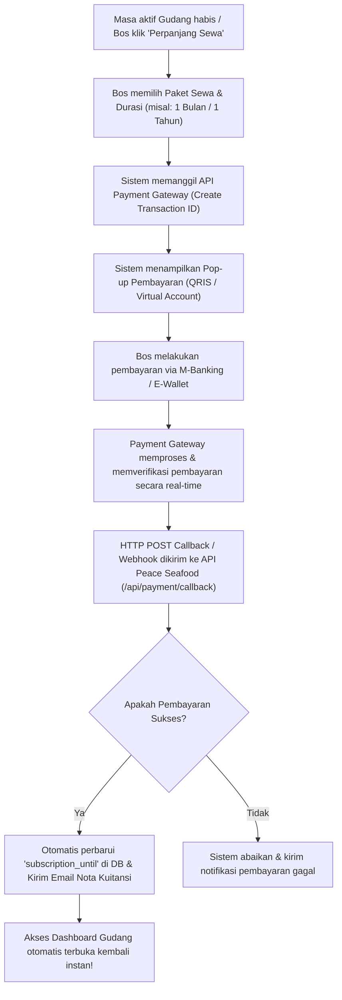

# RANCANGAN SISTEM PEMBAYARAN OTOMATIS (FUTURE AUTOMATED BILLING)
## PEACE SEAFOOD — PLATFORM SaaS MULTI-TENANT

Dokumen ini adalah panduan arsitektur teknis masa depan untuk mengintegrasikan **Gerbang Pembayaran Otomatis (Payment Gateway)** ke dalam platform SaaS Peace Seafood, ketika Anda sudah siap untuk beralih dari sistem konfirmasi WhatsApp manual ke sistem pembayaran otomatis 24/7 tanpa campur tangan manusia.

---

## 1. Arsitektur Gerbang Pembayaran (Payment Gateway) di Indonesia

Untuk pasar Indonesia, penyedia layanan Payment Gateway terbaik, gratis biaya pendaftaran, dan memiliki dokumentasi integrasi API PHP yang sangat lengkap adalah **Midtrans** atau **Xendit**.

Sistem ini mendukung pembayaran otomatis via:
* **Virtual Account (VA)**: BCA, Mandiri, BNI, BRI, Permata.
* **E-Wallet / QRIS**: GoPay, OVO, Dana, LinkAja, ShopeePay (sangat cocok untuk Bos Gudang skala UMKM).
* **Retail Outlet**: Alfamart, Indomaret.

---

## 2. Alur Logika Pembayaran Otomatis (Automated Workflow)

Berikut adalah cetak biru alur transaksi otomatis dari hulu ke hilir:



---

## 3. Struktur Database Pendukung (Masa Depan)

Untuk mencatat riwayat transaksi otomatis secara rapi, berikut adalah tabel baru yang perlu ditambahkan kelak:

```sql
-- Tabel untuk menyimpan riwayat transaksi pembayaran SaaS
CREATE TABLE IF NOT EXISTS `saas_orders` (
  `id`                INT          NOT NULL AUTO_INCREMENT,
  `id_gudang`         INT          NOT NULL,
  `id_bos`            INT          NOT NULL,
  `order_id`          VARCHAR(100) NOT NULL, -- Kode unik transaksi (misal: INV-20260526-XYZ)
  `gross_amount`      BIGINT       NOT NULL, -- Total nominal pembayaran
  `payment_type`      VARCHAR(50)  NULL,     -- Jenis pembayaran (qris, bank_transfer, dll)
  `transaction_status`VARCHAR(50)  NOT NULL DEFAULT 'pending', -- pending, settlement, expire, deny
  `snap_token`        VARCHAR(255) NULL,     -- Token integrasi frontend
  `created_at`        TIMESTAMP    NOT NULL DEFAULT CURRENT_TIMESTAMP,
  `updated_at`        TIMESTAMP    NOT NULL DEFAULT CURRENT_TIMESTAMP ON UPDATE CURRENT_TIMESTAMP,
  PRIMARY KEY (`id`),
  UNIQUE KEY `uq_order_id` (`order_id`),
  CONSTRAINT `fk_orders_gudang` FOREIGN KEY (`id_gudang`) REFERENCES `gudang` (`id`)
) ENGINE=InnoDB DEFAULT CHARSET=utf8mb4 COLLATE=utf8mb4_unicode_ci;
```

---

## 4. Logika Webhook Callback PHP (Contoh Kode API Backend)

Ketika Bos selesai membayar, server Payment Gateway (misal: Midtrans) akan mengirimkan notifikasi (*Webhook Callback*) ke endpoint API aplikasi Anda secara otomatis di latar belakang.

Berikut adalah draf file controller PHP (`c:\xamppp\htdocs\peace_seafood\src\controllers\PaymentCallbackController.php`) yang akan dibangun nanti:

```php
<?php
declare(strict_types=1);

namespace App\Controllers;

use App\Utils\Database;
use App\Utils\Response;

class PaymentCallbackController
{
    public function handleMidtransCallback(): void
    {
        // 1. Ambil payload notifikasi dari Midtrans
        $json = file_get_contents('php://input');
        $notification = json_decode($json, true);

        if (!$notification) {
            Response::error('Invalid Payload', 400);
        }

        $orderId = $notification['order_id'];
        $transactionStatus = $notification['transaction_status'];
        $paymentType = $notification['payment_type'];

        // 2. Cari data order sewa di database
        $order = Database::fetchOne("SELECT * FROM saas_orders WHERE order_id = ?", [$orderId]);
        if (!$order) {
            Response::notFound('Order tidak ditemukan');
        }

        // 3. Logika jika pembayaran Sukses (Settlement)
        if ($transactionStatus === 'settlement' || $transactionStatus === 'capture') {
            
            // Perbarui status transaksi di pembukuan Anda
            Database::update('saas_orders', [
                'transaction_status' => 'settlement',
                'payment_type' => $paymentType
            ], 'order_id = ?', [$orderId]);

            // Tambah masa aktif Gudang (misal perpanjang +30 hari dari tanggal expire saat ini)
            $gudangId = (int)$order['id_gudang'];
            $gudang = Database::fetchOne("SELECT subscription_until FROM gudang WHERE id = ?", [$gudangId]);
            
            // Jika tanggal expire sudah lewat, hitung dari hari ini. Jika belum lewat, akumulasikan.
            $currentExpire = $gudang['subscription_until'] ?? date('Y-m-d');
            $baseDate = (strtotime($currentExpire) < time()) ? date('Y-m-d') : $currentExpire;
            $newExpire = date('Y-m-d', strtotime($baseDate . ' + 30 days'));

            // Update database sewa gudang agar aktif kembali secara instan!
            Database::update('gudang', [
                'subscription_until' => $newExpire,
                'status_langganan' => 'aktif'
            ], 'id = ?', [$gudangId]);

            // Kirim email kuitansi otomatis ke email Bos
            // ... (PHPMailer Send Action)
        }

        Response::success(null, 'Callback processed successfully');
    }
}
```

---

## 5. Keuntungan Sistem Otomatis Ini Kelak:
1. **Bekerja 24 Jam**: Bos bisa memperpanjang sewa kapan saja (misal jam 2 malam saat masa trial-nya habis mendadak) tanpa harus menunggu Anda bangun tidur atau membalas pesan WhatsApp mereka.
2. **Skalabilitas Tanpa Batas**: Anda bisa mengelola ribuan tenant/gudang secara otomatis tanpa perlu repot mencocokkan mutasi bank manual satu per satu.
3. **Terlihat Sangat Profesional**: Menempatkan level platform Anda setara dengan SaaS global lainnya.
