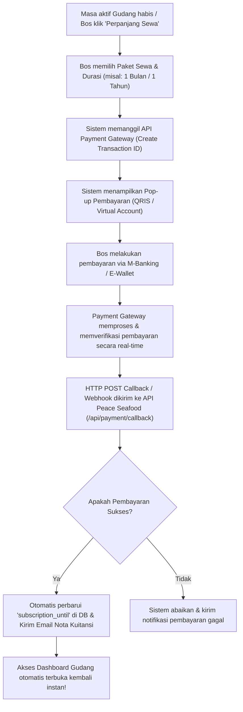

# Rancangan Sistem Pembayaran Otomatis

Catatan desain untuk billing otomatis di masa depan.

---

## 1. Opsi gateway

- Midtrans atau Xendit sebagai kandidat utama.
- Kanal pembayaran: Virtual Account, QRIS, e-wallet, dan retail outlet.

---

## 2. Alur yang diinginkan



---

## 3. Struktur data yang dibutuhkan

```sql
-- Tabel untuk menyimpan riwayat transaksi pembayaran SaaS
CREATE TABLE IF NOT EXISTS `saas_orders` (
  `id`                INT          NOT NULL AUTO_INCREMENT,
  `id_gudang`         INT          NOT NULL,
  `id_bos`            INT          NOT NULL,
  `order_id`          VARCHAR(100) NOT NULL, -- Kode unik transaksi (misal: INV-20260526-XYZ)
  `gross_amount`      BIGINT       NOT NULL, -- Total nominal pembayaran
  `payment_type`      VARCHAR(50)  NULL,     -- Jenis pembayaran (qris, bank_transfer, dll)
  `transaction_status`VARCHAR(50)  NOT NULL DEFAULT 'pending', -- pending, settlement, expire, deny
  `snap_token`        VARCHAR(255) NULL,     -- Token integrasi frontend
  `created_at`        TIMESTAMP    NOT NULL DEFAULT CURRENT_TIMESTAMP,
  `updated_at`        TIMESTAMP    NOT NULL DEFAULT CURRENT_TIMESTAMP ON UPDATE CURRENT_TIMESTAMP,
  PRIMARY KEY (`id`),
  UNIQUE KEY `uq_order_id` (`order_id`),
  CONSTRAINT `fk_orders_gudang` FOREIGN KEY (`id_gudang`) REFERENCES `gudang` (`id`)
) ENGINE=InnoDB DEFAULT CHARSET=utf8mb4 COLLATE=utf8mb4_unicode_ci;
```

---

## 4. Callback yang dibutuhkan

- Terima webhook pembayaran.
- Validasi transaksi.
- Perbarui `subscription_until`.
- Simpan riwayat order dan status pembayaran.

## 5. Status

Dokumen ini masih future plan. Jangan diperlakukan sebagai implementasi aktif sampai gateway benar-benar dipasang.
